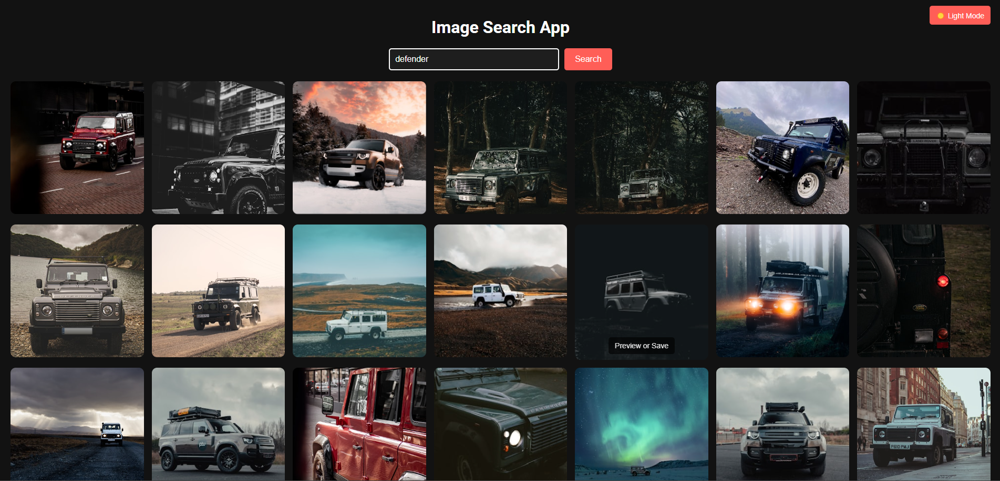

# 📸 Image Search App  

A simple and stylish **Image Search App** that fetches high-quality images from the Unsplash API. It features **dark mode**, **light mode**, and a smooth user experience with a **responsive design**.

---

## જ⁀➴ Click On Image For Live Preview

 [](https://premgchavan.github.io/Image-Search-App/)

---

## 🚀 Features  

✅ **Search & Display Images** – Fetch images from Unsplash API  
✅ **Dark & Light Mode** – Toggle between themes  
✅ **Hover Effects** – Smooth animations  
✅ **Show More** – Load additional images  
✅ **Fully Responsive** – Works on all devices  

---

## 📌 Technologies Used  

- **HTML** – Structure  
- **CSS** – Styling & Animations  
- **JavaScript** – Fetching API data & interactivity  
- **Unsplash API** – Image source  

## 📂 Project Structure  

```
/Image-Search-App
│──── /assets           # Static files (screenshots) 
│──── styles.css        # Main CSS file  
│──── script.js         # JavaScript functionality  
│──── index.html        # Main HTML file  
│──── README.md         # Project documentation  
```

---

## ⚙️ Setup & Installation  

### 1️⃣ Clone the Repository  
```sh
git clone https://github.com/PremGChavan/Image-Search-App
cd Image-Search-App
```

### 2️⃣ Open the Project  
Simply open `index.html` in your browser.

### 3️⃣ API Key Setup  
1. Get an API key from **Unsplash API**: [Unsplash Developers](https://unsplash.com/developers)  
2. Replace `YOUR_API_KEY` in `script.js` with your own key.

---

## 📜 Usage  

1️⃣ Enter a search term in the input field  
2️⃣ Click **Search** to display images  
3️⃣ Click **Save** to open an image in a new tab  
4️⃣ Click **Show More** to load additional images  
5️⃣ Toggle **Dark Mode** for a better viewing experience  

---
